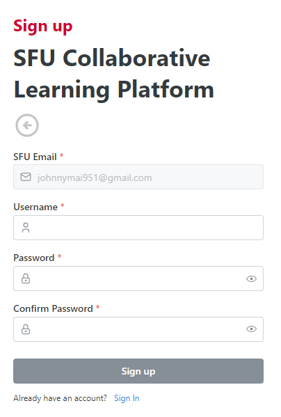

# SFU Connect
An Online Collaborative Learning Platform built for students to connect and engage. 

### Built With

* 
* 
* 
* 
* 
* 
* 

## Preview

SFU Connect is a full-stack web application that supports features such as:

### 1. User Authentication

- Email + Password Logins
  
  

- Email Verified Signups
  

    
     
  

### 2. Resource Hosting

- Resources Tab to access hosted files
  
    

- File uploads
  
    

### 3. QuizzerHub

- User created study cards

  
  

- Viewing Created Quizzes
  

    
     
  

## Architecture

SFU Connect is built with a microservice architecture and is deployed using serverless GCP technologies.

The system is designed to be secure, performant, scalable, and available. 

### System Design Diagram

## Note

Since the deployment of this project relies on GCP credits, a working deployment link is unfortunately unavailable. 

The local setup for this project is also quite inconvenient to get running, and tbh, nobody is likely reading this README anyways.

A working demo has been left as an exercise to the reader.
